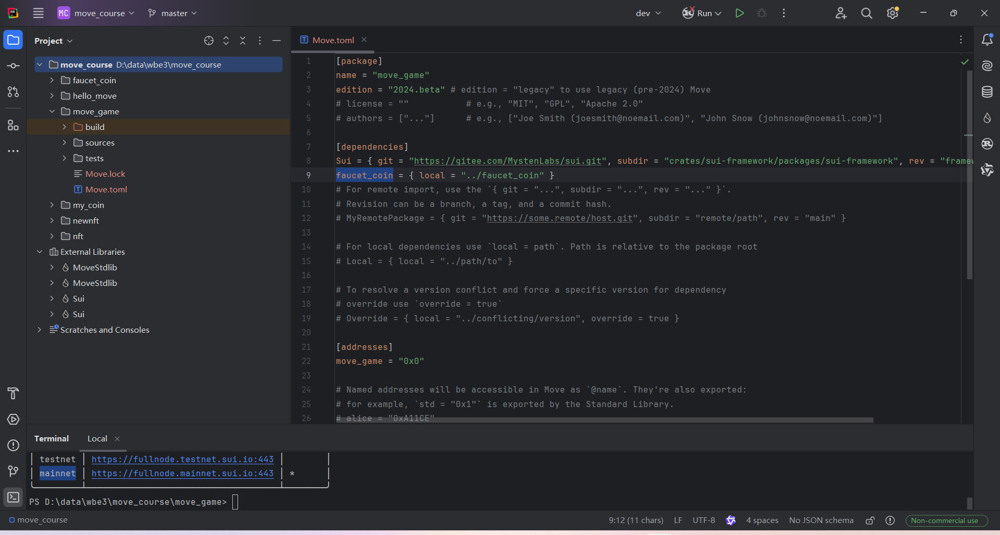

# 04. move_game

# **完成游戏的上链部署**

- 上链网络: 主网(mainnet)

# **需求**

- 完成 链游相关知识的学习
- 完成 随机数的学习，游戏必须包含随机数
- 完成 存和取游戏资金池
- 完成 如何存储Coin在合约的学习，游戏必须能存取[task2] 发行的`Faucet Coin`,用`task2`的 `Faucet Coin`作为游戏输赢的资产
- 完成 第一个游戏合约部署主网
- 的game 必须包含自己的 `github id`的元素

# 链游基本知识

## **一、链游的定义与基本概念**

- **定义**：链游，即区块链游戏，是将游戏与区块链技术相结合的产物。它利用区块链的分布式账本、加密算法、智能合约等特性，为游戏带来全新的玩法、经济模式和所有权机制等。
- **核心要素**：
    - **区块链底层技术**：提供去中心化的账本记录，确保游戏数据的透明性、不可篡改和安全性。比如以太坊、波场等区块链平台常被用作链游的底层支撑。
    - **智能合约**：自动执行合约条款的计算机程序，在链游中用于处理游戏规则、资产交易、奖励分配等诸多事宜。例如在一款加密宠物养成游戏中，智能合约可以规定宠物繁殖的规则以及新宠物的归属等。
    - **加密货币与通证**：作为游戏内的经济媒介，玩家可通过游戏活动获取，也用于购买游戏道具、升级等。不同链游有自己的原生通证，像 Axie Infinity 中的 AXS 和 SLP。

## **二、链游的特点**

- **资产所有权归玩家**：游戏内的虚拟资产（如角色、道具、土地等）以区块链上的通证形式存在，玩家真正拥有这些资产的所有权，可自由交易、转移，甚至跨游戏使用，不像传统游戏中玩家只是获得游戏厂商授予的使用权限。
- **去中心化运营**：游戏的部分或全部运营环节由区块链网络的节点共同参与完成，减少了对单一游戏厂商的依赖。例如游戏更新、规则调整等可能通过社区投票等去中心化方式进行。
- **透明且可审计的经济系统**：基于区块链的账本记录，游戏内的经济活动一目了然，每一笔交易、资产的产生和流转都清晰可查，能有效防止游戏厂商随意增发货币、操纵经济等情况。

## **三、链游的常见类型**

- **收藏养成类**：如 Axie Infinity，玩家收集、培养虚拟宠物，通过战斗、繁殖等活动获取收益。这类游戏注重宠物的属性成长和稀有度，玩家之间可交易宠物及相关繁殖材料。
- **角色扮演类**：结合区块链技术的传统角色扮演游戏，玩家的角色属性、装备等以区块链资产形式存在。例如 My Crypto Heroes，玩家在游戏世界中冒险，升级角色并通过完成任务等方式获取奖励通证。
- **策略竞技类**：像 League of Kingdoms，玩家需要运用策略规划领地、组建军队，与其他玩家进行竞技对抗，胜利可获得游戏通证奖励，游戏中的领土、资源等也是可交易的区块链资产。
- **模拟经营类**：例如 Crypto Tycoon，玩家经营虚拟企业或地产，通过合理运营产生收益，收益可以通证形式体现，且经营的资产可在市场上交易。

## **四、链游的发展历程**

- **萌芽期（2013 - 2017 年）**：这一时期区块链技术逐渐兴起，一些简单的区块链游戏开始出现，主要是以比特币等加密货币为基础的简单博彩或挖矿类游戏，游戏性不强，但开启了链游的探索之路。
- **成长期（2018 - 2021 年）**：以太坊等智能合约平台的发展推动了链游的快速成长。Axie Infinity 等具有一定游戏性和经济模型的链游受到广泛关注，吸引了大量玩家和投资者，链游行业开始形成规模。
- **调整期（2022 - 至今）**：随着加密货币市场的波动以及监管环境的变化，链游行业也进入了调整阶段。一些粗制滥造、过度依赖炒作的链游逐渐被淘汰，而注重游戏品质、合规运营的链游仍在持续发展。

## **五、链游的优势与挑战**

- **优势**：
    - **创新的经济模式**：为玩家提供了新的赚钱途径，通过玩游戏可以获得有实际价值的通证，在一些发展中国家甚至催生了 “边玩边赚”（Play-to-Earn）的现象，帮助部分玩家改善了经济状况。
    - **玩家社区驱动**：去中心化的特性使得玩家在游戏发展、规则制定等方面有更多话语权，能形成更活跃、自主的玩家社区，推动游戏不断优化。
    - **跨游戏资产流通**：理论上，玩家的区块链资产可以在不同链游之间流通，增加了资产的附加值和使用场景。
- **挑战**：
    - **技术门槛**：区块链技术本身较为复杂，开发链游需要掌握区块链编程、智能合约开发等专业知识，导致开发成本较高、开发周期较长。
    - **用户体验**：部分链游由于过于注重区块链技术的应用，而忽视了游戏的基本体验，如画面质量、操作流畅性等，导致用户流失。
    - **监管不确定性**：目前全球范围内对链游的监管政策尚不明确，不同国家和地区有不同的态度和规定，这给链游的发展带来了一定的风险。

# 简单的翻硬币游戏

主要功能包括：
初始化：创建游戏对象和管理员权限对象，并将管理员权限对象转移给发送者。
玩游戏：玩家通过猜测硬币的正反面来参与游戏，根据结果赢得或失去 SUI 币。
添加 SUI：允许玩家向游戏中添加 SUI 币。
移除 SUI：允许管理员从游戏中移除 SUI 币。

CFG流程图


## 1. 初始化源码解析

```rust
/// 定义游戏对象
public struct Game has key {
    id: UID,
    val: Balance<SUI>
}
/// 定义管理员权限对象
public struct AdminCap has key {
    id: UID,
}
/// 创建游戏对象和管理员权限对象，并将管理员权限对象转移给发送者。
fun init(ctx: &mut TxContext) {
    let game = Game {
        id: object::new(ctx),
        val: balance::zero()
    };
    share_object(game);

    let admin = AdminCap {
        id: object::new(ctx)
    };
    transfer(admin, sender(ctx));
}
```

## 2. 玩游戏源码解析

```rust
entry fun play(game: &mut Game, flip_value: bool, in: Coin<SUI>, rand: &Random,
                      ctx: &mut TxContext) {
    let coin_value = coin::value(&in);

    let play_address = sender(ctx);
    let game_val = balance::value(&game.val) ;
    /// 检查游戏余额是否足够。
    if (game_val < coin_value) {
        abort 100u64;
    };

    let mut gen = random::new_generator(rand, ctx);
    /// 生成随机布尔值。
    let mut flag = random::generate_bool(&mut gen);
    
    if (flip_value == flag) {
        /// 如果玩家猜对了，将相应的余额转移给玩家。
        let win_balance = balance::split(&mut game.val, coin_value);
        let win_coin = from_balance(win_balance, ctx);
        public_transfer(win_coin, play_address);
        public_transfer(in, play_address);
    } else {
        /// 否则，将玩家的投注金额加入游戏余额。
        let in_balance = into_balance(in);
        balance::join(&mut game.val, in_balance);
    }
}
```

## 3. 添加 SUI源码

```rust
public entry fun add_sui(game: &mut Game, in: Coin<SUI>, _ctx: &TxContext) {
    let in_balance = into_balance(in);
    balance::join(&mut game.val, in_balance);
}
```

## 4. 移除 SUI源码

```rust
public entry fun remove_sui(_: &AdminCap, game: &mut Game,
                            amt: u64, ctx: &mut TxContext) {
    let win_balance = balance::split(&mut game.val, amt);
    let win_coin = from_balance(win_balance, ctx);
    public_transfer(win_coin, sender(ctx));
}
```

例子里面留了两个todo，

1. **防止 all in 战神**

```rust
/// 防止 all in 战神
if (coin_value == game_val) {
		abort(ERROR_EXCEED_MAX_BET);
};

```

1. **每次最大值 就是合约里面钱的10分之一**

```rust
/// 这个限制住了自然也不存在ALLIN了
if (coin_value > game_val / 10) {
    abort 101u64;
}

```

## 5. TASK操作步骤

### 5.1. 代码

```bash
/*
/// Module: move_game
module move_game::move_game;
*/
module move_game::flip_coin {

    use sui::balance;
    use sui::balance::Balance;
    use sui::coin;
    use sui::coin::{Coin, from_balance, into_balance};
    use sui::object;
    use sui::random;
    use sui::random::Random;
    use sui::transfer::{share_object, transfer, public_transfer};
    use sui::tx_context::sender;
    use faucet_coin::leon_dev_1024_faucet_coin::{LEON_DEV_1024_FAUCET_COIN};

    public struct Game has key {
        id: UID,
        val: Balance<LEON_DEV_1024_FAUCET_COIN>
    }
    public struct AdminCap has key {
        id: UID,
    }
    fun init(ctx: &mut  TxContext) {
        let game = Game {
            id: object::new(ctx),
            val: balance::zero()
        };
        share_object(game);

        let admin = AdminCap {
            id: object::new(ctx)
        };

        transfer(admin, sender(ctx));
    }

    entry fun play(game: &mut Game, flip_value: bool, in: Coin<LEON_DEV_1024_FAUCET_COIN>, rand: &Random,
                   ctx: &mut TxContext) {
        let coin_value = coin::value(&in);

        let play_address = sender(ctx);
        let game_val = balance::value(&game.val) ;

        if (game_val < coin_value) {
            abort 100u64;
        };

        //防止 all in 战神
        //每次最大值 就是合约里面钱的10分之一就行了
        if (coin_value > game_val / 10) {
            abort 101u64;
        };

        let mut gen = random::new_generator(rand, ctx);

        let mut flag = random::generate_bool(&mut gen);

        if (flip_value == flag) {
            let win_balance = balance::split(&mut game.val, coin_value);
            let win_coin = from_balance(win_balance, ctx);
            public_transfer(win_coin, play_address);
            public_transfer(in, play_address);
        }else {
            let in_balance = into_balance(in);
            balance::join(&mut game.val, in_balance);
        }
    }

    // 存钱
    public entry fun add_sui(game: &mut Game, in: Coin<LEON_DEV_1024_FAUCET_COIN>, _ctx: &TxContext) {
        let in_balance = into_balance(in);
        balance::join(&mut game.val, in_balance);
    }

    // 取钱
    public entry fun remove_sui(_: &AdminCap, game: &mut Game,
                                amt: u64, ctx: &mut TxContext) {
        let win_balance = balance::split(&mut game.val, amt);
        let win_coin = from_balance(win_balance, ctx);
        public_transfer(win_coin, sender(ctx));
    }
}

```

### 5.2. 部署

修改Move.toml文件，添加之前的`faucet_coin`



```rust
sui move build --skip-fetch-latest-git-deps
```

### 5.3. 发布到主网

当前环境查看和网络环境切换参考之前的命令

```rust
sui client envs
sui client switch --env mainnet
sui client publish --gas-budget 100000000 --skip-fetch-latest-git-deps --skip-dependency-verification
```

发布成功后的交易摘要

```bash
Skipping dependency verification
Transaction Digest: 2kBk7UGLLrAodgVkxfmoaCh4SvQxHMuqYKKkWd8dyZeL
```

## 6. 测试验证

### 6.1 充值


### 3.2 玩游戏 play

```bash
sui client call --package 0x1bd47788320409d493dacf5c55fccca592b4cbde9012e3cdcd4ace2b3489a48e --module flip_coin --function play --args 0xa16a5c2a95a4d9fa151dd7faf44e160bc0f1c4ef12b6fc628c3c9cd1895a0da1 true 0xafcdeac741cb1b84d72d7ac8fbb851ce81089e187f8ead34b81a6f0b544cbb59 0x8 --gas-budget 1000000
```

### 3.3 提现 方法`remove_sui`

提现参数说明，

- **`AdminCap`**：确保只有管理员可以调用这个函数。
- **`Game`**：用于访问和修改游戏的状态。
- **`amt`**：指定要取出的金额。
- **`TxContext`**：提供交易上下文信息，用于创建 `Coin` 对象和获取发送者的地址。


```bash
sui client call --package 0x1bd47788320409d493dacf5c55fccca592b4cbde9012e3cdcd4ace2b3489a48e --module flip_coin --function remove_sui --args 0xda2dc3c6cc563fb9b3d0a1050bbb237da0949014a7ca38de1fb16a62664c55cc 0xa16a5c2a95a4d9fa151dd7faf44e160bc0f1c4ef12b6fc628c3c9cd1895a0da1 100 --gas-budget 10000000
```

## FAQ

Q1:  直接钱包浏览器页面play 报错， **Expect true to be boolean, received string**

A：提现报错，这边用Bash命令操作，注意参数的顺序，Random的object id为0x8


Q2: 提现报错 Error executing transaction 'DWtg68kXBTVoHYHgRxXbTbE2ckQx9zeLQPnGDnJ6H6UA': InsufficientGas

A. 提现消耗的Gas手续费比较多，增加gas费用，最后提现成功

