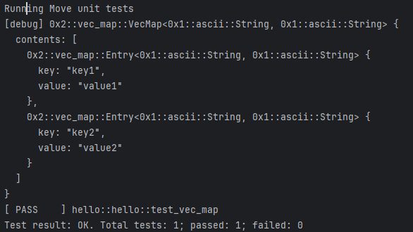
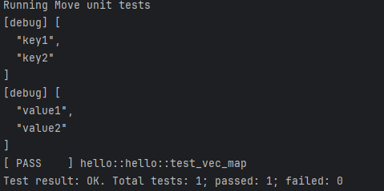

# move入门之集合(二) : Vector数据衍生类型VecMap深度分析
**🧑‍💻作者：gracecampo**
## 概述

之前的文章中，我们学习了vector,vecSet两种常用的集合数据结构，此章我们通过对前两种数据结构的回顾以及对比，探究下vecSet这种集合类型。

## VecMap是什么？

所属模块及包:    Module 0x2::vec_map

**VecSet的特点:**

由向量<vector>支持的map(即key-value)数据结构。

**在此数据中键(key)是唯一的，不允许重复。

数据是按照插入顺序排序，可根据key值获取相关value值。

时间复杂度与vecSet一致，均为O（N），vecSet不同是是vecMap是一种键值对的数据结构，而vecSet是值即是key，key也是值。

### 定义和语法
#### 如何去声明一个vecSet:
```move
      let vec_map = vec_map::empty<>();
```

我们通过调用vec_map的empty函数，可以声明一个空的vec_map集合。
```move
let vec_map = vec_map::empty<u8,String>();
```

当然，我们可以显式指定该集合种key与value的类型。

#### 

## VecMap是如何实现的？
接下来，我们通过对源码层面的刨析，探究它是如何实现的。
### 结构体的声明
```move
public struct VecMap<K: copy, V> has copy, drop, store {
    contents: vector<Entry<K, V>>,
}

/// An entry in the map
public struct Entry<K: copy, V> has copy, drop, store {
    key: K,
    value: V,
}
```
我们可以看到，在源码中，声明了一个Entry结构体，它包含两个元素，分别的key,value，而key,value都定义为一个泛型对象K ,V 

而主要结构体（即定义vecMap）中实际是通过将Entry放入到Vector容器中，从而实现map类型的支持。

需要注意的点是： key必须是拥有copy能力的类型。

### 异常码定义
可以看到，在VecMap中声明了6种常量，来标识不同的异常信息
```move
///当插入map中已经存在key时异常码
const EKeyAlreadyExists: u64 = 0;

/// 用户在获取不存在key时异常码
const EKeyDoesNotExist: u64 = 1;

/// 销毁不为空的map时的异常码
const EMapNotEmpty: u64 = 2;

/// 当获取或者移除的数据下标超出map集合时的异常码
const EIndexOutOfBounds: u64 = 3;

/// 当尝试移除空集合末尾数据时的异常码
const EMapEmpty: u64 = 4;

/// 当尝试通过keys 和values组装maps时，传入的keys 和values不一致时的异常码
const EUnequalLengths: u64 = 5;
```
### 函数定义

创建一个空的map集合
```move
public fun empty<K: copy, V>(): VecMap<K, V> {
    VecMap { contents: vector[] }
}
```
向map中添加元素  : 参数为: 1.可变引用map,2. 添加元素的key 3.添加元素的value
当元素中已存在传入的key时，将提示异常码：`EKeyAlreadyExists`
**注意点： 传入的map必须为可变引用类型  key 必须时用户copy能力的类型**
```move
public fun insert<K: copy, V>(self: &mut VecMap<K, V>, key: K, value: V) {
    assert!(!self.contains(&key), EKeyAlreadyExists);
    self.contents.push_back(Entry { key, value })
}
```
根据key移除相关元素
通过调用get_idx函数，获取相关key的小标，通过下标将数据移除，并返回移除元素信息
当传入key不存在时，将提示异常码：`EKeyDoesNotExist`
```move
/// Remove the entry `key` |-> `value` from self. Aborts if `key` is not bound in `self`.
public fun remove<K: copy, V>(self: &mut VecMap<K, V>, key: &K): (K, V) {
    let idx = self.get_idx(key);
    let Entry { key, value } = self.contents.remove(idx);
    (key, value)
}
```

根据key,判断map元素中，是否存在相同的key元素
```move
/// Return true if `self` contains an entry for `key`, false otherwise
public fun contains<K: copy, V>(self: &VecMap<K, V>, key: &K): bool {
    get_idx_opt(self, key).is_some()
}
```

返回map的长度  参数：引用map
```move
public fun size<K: copy, V>(self: &VecMap<K, V>): u64 {
    self.contents.length()
}
```

析构map的key和value,并返回key集合和value集合
```move
public fun into_keys_values<K: copy, V>(self: VecMap<K, V>): (vector<K>, vector<V>) {
    let VecMap { mut contents } = self;
    contents.reverse();
    let mut i = 0;
    let n = contents.length();
    let mut keys = vector[];
    let mut values = vector[];
    while (i < n) {
        let Entry { key, value } = contents.pop_back();
        keys.push_back(key);
        values.push_back(value);
        i = i + 1;
    };
    contents.destroy_empty();
    (keys, values)
}
```
用于将两个vector向量合并为一个vecMap
```move
public fun from_keys_values<K: copy, V>(mut keys: vector<K>, mut values: vector<V>): VecMap<K, V> {
    assert!(keys.length() == values.length(), EUnequalLengths);
    //通过反转keys和values元素顺序，保证在处理过程中，最终返回的元素顺序
    //是按照keys和values添加顺序组合
    keys.reverse();
    values.reverse();
    let mut map = empty();
    while (keys.length() != 0) map.insert(keys.pop_back(), values.pop_back());
    keys.destroy_empty();
    values.destroy_empty();
    map
}
```
当然，Module 0x2::vec_map中，对于vecMap的操作函数还有很多，比如获取下标，判断map是否为空，销毁空的map等等，

如果同学感兴趣，可以进行自行翻阅相关源码。本节只对日常使用频繁的函数做下说明。

## VecMap应该如何使用？
接下来，我们开始实战环节

声明一个空map，并添加元素进入

**insert函数**

```move
//声明一个空的map对象
let mut vec_map = vec_map::empty<String,String>();
//添加一个键值对
vec_map.insert(string(b"key1"),string(b"value1"));
vec_map.insert(string(b"key2"),string(b"value2"));
debug::print(&vec_map);
```
我们通过debug::print 打印出vec_map中的元素：



可以看到，我们已经将键值对`key1,key2`添加进入。
insert需要注意的是，不能存放相同key的数据，不然抛出错误信息。

```move
vec_map.insert(string(b"key1"),string(b"value1"));
vec_map.insert(string(b"key1"),string(b"value2"));
```
比如，我们将`key2`改为`key1`,在进行测试时，测试将会失败。

>>Test result: FAILED. Total tests: 1; passed: 0; failed: 1

**remove函数**
```move
//声明一个空的map对象
let mut vec_map = vec_map::empty<String,String>();
//添加一个键值对
vec_map.insert(string(b"key1"),string(b"value1"));
//删除key=key1的数据
vec_map.remove(&string(b"key1"));
debug::print(&vec_map);
```
我们通过先添加一个`string(b"key1"),string(b"value1")`,然后通过`remove`函数进行移除元素`key1`。
当我们运行测试时,vec_map容器内元素`key1`已经被移除：

>>  Running Move unit tests
>>  [debug] 0x2::vec_map::VecMap<0x1::ascii::String, 0x1::ascii::String> {
>>  contents: []
>>  }
>>  [ PASS    ] hello::hello::test_vec_map
>>  Test result: OK. Total tests: 1; passed: 1; failed: 0

**contains函数**
```move
//声明一个空的map对象
let mut vec_map = vec_map::empty<String,String>();
//添加一个键值对
vec_map.insert(string(b"key1"),string(b"value1"));
//通过调用contains函数，并传入key值，判断map容器中是否包含元素key1
let contains = vec_map.contains(&string(b"key1"));
debug::print(&contains);
```

>>  Running Move unit tests
>>  [debug] true
>>  [ PASS    ] hello::hello::test_vec_map
>>  Test result: OK. Total tests: 1; passed: 1; failed: 0


**size函数**
```move
//声明一个空的map对象
let mut vec_map = vec_map::empty<String,String>();
//添加一个键值对
vec_map.insert(string(b"key1"),string(b"value1"));
//通过调用map_size函数，返回map中元素个数
let map_size = vec_map.size();
debug::print(&map_size);
```
通过调用map_size函数，返回map中元素个数

debug打印出的元素个数符合我们预期 `1`

>>Running Move unit tests
>>[debug] 1
>>[ PASS    ] hello::hello::test_vec_map
>>Test result: OK. Total tests: 1; passed: 1; failed: 0

**from_keys_values函数**
```move
//声明两个向量，将vec_key元素作为key,vec_value元素作为value,将两向量合并为一个vec_maps
let mut vec_key = vector[string(b"key1"),string(b"key2")];
let mut  vec_value = vector[string(b"value1"),string(b"value2")];
let s = vec_map::from_keys_values<String,String>(vec_key,vec_value);
debug::print(&s);
```
通过声明两个向量，将vec_key元素作为map的key,vec_value元素作为map的value,将两向量合并为一个vec_maps

**需要注意的时:vec_key元素 和vec_value 必须长度一致，否则将抛出异常**


**into_keys_values**
```move
//声明两个向量，将vec_key元素作为key,vec_value元素作为value,将两向量合并为一个vec_maps
let mut vec_key = vector[string(b"key1"),string(b"key2")];
let mut  vec_value = vector[string(b"value1"),string(b"value2")];
let s = vec_map::from_keys_values<String,String>(vec_key,vec_value);
//调用into_keys_values函数，将map的key和value拆分，并以元组形式返回
let (keys, values) = s.into_keys_values();
debug::print(&keys);
debug::print(&values);
```
我们先通过`from_keys_values` 组装一个vec_map,然后通过`into_keys_values`将map中的key和value进行拆分，并通过元组的形式返回
此方法用于当我们需要分开获取key 和value时比较有用



## 总结
通过对vec_map的语法以及函数方法的学习，我们可以对map元素进行修改，也可以在需要组装一个map对象，一个析构一个map对象的函数，进行的讲解和实战，

在日常的开发中，我们可能需要对一些向量对象进行处理，此时vec_map将是不二的数据类型，方便我们声明一些关系型的数据，不需要辛苦维护数据关系，

通过将对象封装为一个vec_map对象，我们可以方便的进行数据操作。


💧  [HOH水分子公众号](https://mp.weixin.qq.com/s/d0brr-ao6cZ5t8Z5OO1Mog)

🌊  [HOH水分子X账号](https://x.com/0xHOH)

📹  [课程B站账号](https://space.bilibili.com/3493269495352098)

💻  Github仓库 https://github.com/move-cn/letsmove
